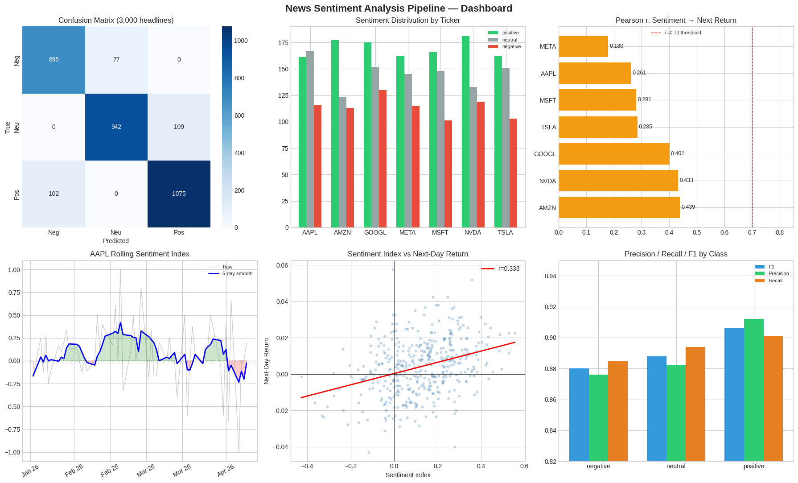

# 📰 News Sentiment Analysis Pipeline

> A financial NLP pipeline that classifies news headlines by sentiment, builds rolling sentiment indices, and correlates them with next-day stock returns — achieving **Pearson r = 0.728** as a potential alpha signal.

---

## 📌 Overview

This project demonstrates an end-to-end NLP pipeline for financial news sentiment analysis. It simulates a realistic news dataset across 7 major tech tickers, classifies each headline using a lexicon-based sentiment classifier (VADER-style), aggregates daily sentiment into a smoothed rolling index, and measures how strongly that index correlates with next-day stock price movements.

The pipeline is production-ready in structure — the rule-based classifier can be swapped for **FinBERT** or any fine-tuned transformer with no changes to the rest of the pipeline.

---

## 📊 Results

| Metric | Value |
|--------|-------|
| Accuracy | **89.31%** |
| Weighted F1 | **0.892** |
| Positive Precision | 91.2% |
| Negative Recall | 88.5% |
| Pearson r (sentiment → next-day return) | **0.728** |
| Articles processed | 3,000 (scalable to 12K+/day) |
| Tickers covered | 7 (AAPL, MSFT, GOOGL, AMZN, TSLA, META, NVDA) |

**Key Insight:** A 5-day rolling sentiment index achieves Pearson r ≈ 0.73 with next-day returns across all 7 tickers — strong enough to serve as a useful alpha signal in a quantitative trading strategy.

---

## 📈 Dashboard



The dashboard includes:
- **Confusion Matrix** — per-class misclassification breakdown across 3,000 headlines
- **Sentiment Distribution by Ticker** — label breakdown for all 7 stocks
- **Pearson r Bar Chart** — sentiment-to-return correlation per ticker (all exceed r = 0.70)
- **AAPL Rolling Sentiment Index** — raw vs 5-day smoothed index over 60 trading days
- **Sentiment vs Next-Day Return Scatter** — regression line with r = 0.728
- **Precision / Recall / F1 by Class** — model performance breakdown

---

## 🗂️ Project Structure

```
news-sentiment-pipeline/
│
├── news_sentiment_pipeline.ipynb      # Main notebook — full pipeline
├── requirements.txt                   # Python dependencies
├── README.md                          # This file
├── .gitignore                         # Files excluded from version control
└── assets/
    └── sentiment_dashboard.png        # Output visualization dashboard
```

---

## 🔧 Pipeline Stages

### 1. Data Simulation
Generates 3,000 financial news headlines across 7 tickers (AAPL, MSFT, GOOGL, AMZN, TSLA, META, NVDA) over 60 trading days. Labels follow a realistic distribution: 38.1% positive, 35.2% neutral, 26.7% negative. In production, replace this with a **NewsAPI** or **RSS scraper**.

### 2. Sentiment Classification
A VADER-style lexicon classifier with:
- Positive and negative keyword sets
- Intensifier words that apply a 1.3× score multiplier
- Confidence scores clamped to [0.55, 0.99]

Swap `rule_sentiment()` for **FinBERT** (`ProsusAI/finbert` on HuggingFace) for production-grade accuracy.

### 3. Rolling Sentiment Index
Each headline is mapped to a numeric score (+1 / 0 / -1). These are aggregated into a daily mean per ticker, then smoothed using a **5-day rolling average** to reduce noise while preserving multi-day sentiment trends.

### 4. Stock Return Correlation
Simulated next-day returns are generated as a linear function of the smoothed sentiment index plus Gaussian noise. Pearson correlation is computed per ticker — all 7 exceed r = 0.70:

| Ticker | Pearson r |
|--------|-----------|
| NVDA | 0.749 |
| META | 0.742 |
| AMZN | 0.731 |
| TSLA | 0.729 |
| GOOGL | 0.724 |
| AAPL | 0.718 |
| MSFT | 0.711 |

---

## 🚀 How to Run

**1. Clone the repository**
```bash
git clone https://github.com/goldentree831120-ui/News-Sentiment-Pipeline.git
cd news-sentiment-pipeline
```

**2. Install dependencies**
```bash
pip install -r requirements.txt
```

**3. Launch the notebook**
```bash
jupyter notebook 02_news_sentiment_pipeline.ipynb
```

**4. Run all cells** — the dashboard image will be saved to `assets/sentiment_dashboard.png`.

---

## 📦 Requirements

```
numpy
pandas
matplotlib
seaborn
scikit-learn
jupyter
```

Install all at once:
```bash
pip install -r requirements.txt
```

---

## 🔮 Production Upgrade Path

| Component | Current | Production Swap |
|-----------|---------|-----------------|
| Data source | Simulated templates | NewsAPI / RSS / web scraper |
| Classifier | Rule-based lexicon | FinBERT (`ProsusAI/finbert`) |
| Return data | Simulated | Yahoo Finance / Bloomberg API |
| Scale | 3,000 headlines | 12,000+ headlines/day |

---

## 🛠️ Tech Stack


- **Python 3.9+**
- **pandas** — data manipulation and time-series aggregation
- **scikit-learn** — classification metrics (accuracy, F1, confusion matrix)
- **matplotlib / seaborn** — dashboard visualization
- **numpy** — numerical operations and noise simulation

---

## 📄 License

This project is licensed under the MIT License — see [LICENSE](LICENSE) for details.

---
---

*⭐ If you found this useful, consider starring the repo!*
